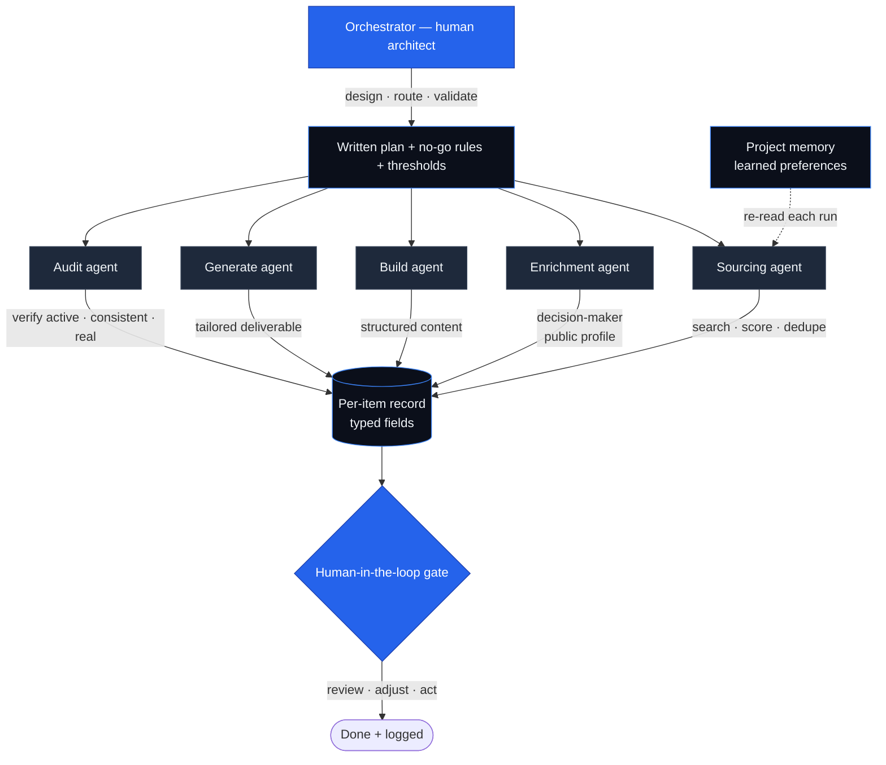
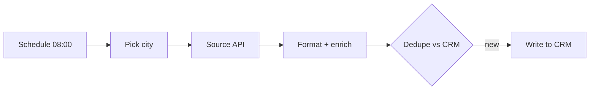

# System Diagram

## Execution layer (unattended automation)

The methodology also drives fully automated workflows (no human at runtime):

See [`workflows/lead-intake-n8n.json`](../workflows/lead-intake-n8n.json) for a runnable example.
