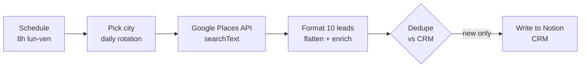

# Workflow — Daily Lead Intake (n8n)

A **real, runnable automation** that powers the "execution" layer of the methodology in this repo. It runs unattended every weekday morning and feeds a CRM with qualified leads.

> This is a **generic template**. All credentials and IDs are placeholders — wire your own before running.

## What it does

1. **Trigger** — cron, every weekday at 08:00.
2. **Pick city** — rotates through 15 French cities by day-of-year (spreads coverage, limits dupes).
3. **Search** — Google Places `searchText` for local businesses in that city. API key read from env (`GOOGLE_PLACES_API_KEY`).
4. **Format** — flattens the response into 10 structured leads with a "point de tension" heuristic (no website → warmer target).
5. **Dedupe** — checks the CRM by company name; keeps only new entries.
6. **Write** — creates the lead in Notion with status, niche, phone, site, city, source.

## Why this is the "execution" proof

- It is **event-driven and unattended** — no human in the loop at runtime.
- It demonstrates the same principles as the agent pipelines: **typed records, dedupe, gate before write, env-based secrets**.
- It is **reusable**: swap the query, the CRM, or the source API and the shape holds.

## Setup

1. Import `lead-intake-n8n.json` into n8n.
2. Set env var `GOOGLE_PLACES_API_KEY` (Google Places API **New**).
3. Create a Notion credential and set `YOUR_NOTION_CREDENTIAL_ID`.
4. Point `YOUR_NOTION_DATABASE_ID` at a Notion database with properties:
   `Entreprise` (title), `Statut` (select), `Niche` (select), `Téléphone` (phone),
   `Site web` (url), `Ville` (rich text), `Point de tension` (rich text), `Source` (rich text).
5. Activate. Watch leads land in the CRM each morning.

## Stack
- **n8n** (self-hosted or cloud) for orchestration.
- **Google Places API** as the source connector.
- **Notion API** as the sink (CRM).
- Secrets via environment variables — nothing hardcoded.
